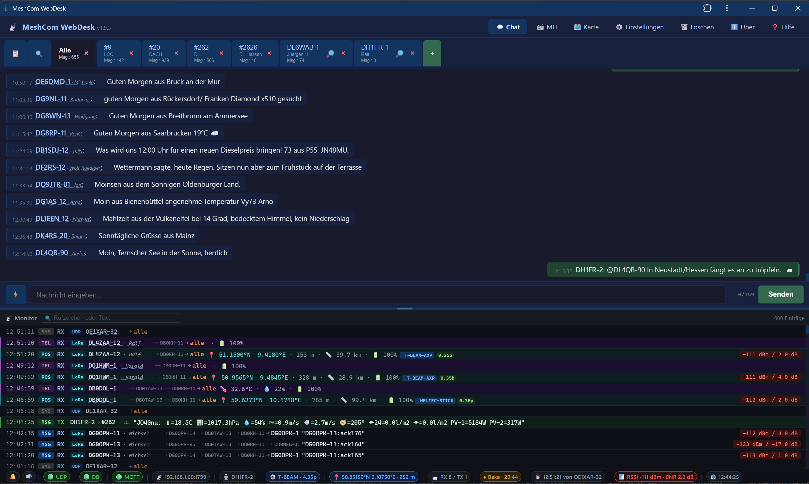

# MeshCom Web Client

A Blazor Server web application for communicating with a [MeshCom](https://icssw.org/meshcom/) device via UDP (EXTUDP protocol).  
Built with **.NET 10** and **Blazor Interactive Server**.

---

## Screenshots

> Place a screenshot as `docs/screenshot.png` and it will appear here.



---

## Features

### 💬 Chat
- Automatic tab management per conversation partner
- **Broadcast tab „Alle"** for `*` / `CQCQCQ` messages
- **Direct messages** – each callsign gets its own tab automatically
- **Group messages** – group destinations appear as `#<group>` tabs
- Smart routing: broadcast replies from a known callsign appear in their direct tab

### 📻 MH – Most Recently Heard
- Live table of all heard stations with last message, timestamp and message count
- **GPS position** parsed from EXTUDP position packets (`lat_dir` / `long_dir` APRS format)
- **Distance calculation** (Haversine) from own node position to each heard station
- **RSSI / SNR** signal quality with colour coding (green / yellow / red)
- Altitude correctly converted from APRS feet to metres
- 🗺️ OpenStreetMap link per station
- Own position extracted automatically from the node's `type:"pos"` UDP beacon

### 📡 Monitor (lower pane)
- Structured display with type badge (`MSG` / `POS` / `SYS`), direction (`RX` / `TX`), routing and signal
- Colour-coded rows: green left border for TX, cyan for position beacons
- Configurable history limit (`MonitorMaxMessages`)

### 📊 Status bar
- UDP socket state (🟢 Aktiv / 🔴 Inaktiv) and registration status
- Last RX timestamp and sender callsign
- Last RSSI / SNR with colour coding
- TX counter, own callsign, device IP:Port

### 🌐 Navigation
- Top navigation bar: **Chat** · **📻 MH** · **ℹ️ Über**
- About page with copyright

### 📝 Logging (Serilog)
- Rolling daily log files with configurable retention
- Optional UDP traffic log (`LogUdpTraffic`) for offline analysis

---

## Architecture

```
MeshcomWebClient/              ← Blazor Server (ASP.NET Core host)
│  Program.cs                  ← DI setup, Serilog, hosted service
│  appsettings.json            ← All configuration
│
├─ Components/
│  ├─ Layout/
│  │    MainLayout.razor       ← Top navigation bar
│  └─ Pages/
│       Chat.razor             ← Chat tabs + monitor
│       Mh.razor               ← Most Recently Heard table
│       About.razor            ← Copyright / info page
│
├─ Helpers/
│     GeoHelper.cs             ← Haversine, coordinate formatting, OSM links
│
├─ Models/
│     MeshcomMessage.cs        ← Message model (from/to/text/GPS/RSSI)
│     MeshcomSettings.cs       ← Strongly-typed config (IOptions)
│     ChatTab.cs               ← Tab model
│     HeardStation.cs          ← MH list entry with GPS + signal data
│     ConnectionStatus.cs      ← Live UDP status + own GPS position
│
└─ Services/
      MeshcomUdpService.cs     ← BackgroundService: UDP RX/TX, GPS parsing
      ChatService.cs           ← Singleton: routing, tabs, MH list, monitor feed

MeshcomWebClient.Client/       ← Blazor WebAssembly client project
```

---

## Configuration

All settings in `MeshcomWebClient/appsettings.json`:

```json
"Meshcom": {
  "ListenIp":          "0.0.0.0",      // bind address (0.0.0.0 = all interfaces)
  "ListenPort":        1799,            // local UDP port
  "DeviceIp":          "192.168.1.60", // MeshCom node IP
  "DevicePort":        1799,            // MeshCom node UDP port
  "MyCallsign":        "DH1FR-2",      // own callsign
  "LogPath":           "C:\\Temp\\Logs",
  "LogRetainDays":     30,             // log file retention in days
  "LogUdpTraffic":     false,          // log every UDP packet to file
  "MonitorMaxMessages": 1000           // max monitor history (oldest dropped)
}
```

### LAN access (iPad / mobile)

The `lan` launch profile binds to all network interfaces:

```powershell
# In Visual Studio: select profile "lan" next to the Run button
# Then open in browser on any device in the same network:
http://192.168.x.x:5162
```

### UDP traffic logging

Set `"LogUdpTraffic": true` to write every packet to the log file:

```
[INF] [UDP-RX] 192.168.1.60:1799 {"src_type":"lora","type":"msg","src":"DH1FR-1",...}
[INF] [UDP-TX] 192.168.1.60:1799 {"type":"msg","dst":"DH1FR-1","msg":"Hello"}
```

Filter the log file:
```powershell
Select-String "\[UDP-RX\]" C:\Temp\Logs\MeshcomWebClient-*.log
Select-String "\[UDP-TX\]" C:\Temp\Logs\MeshcomWebClient-*.log
```

---

## EXTUDP Protocol

| Direction | Format |
|-----------|--------|
| Registration | `{"type":"info","src":"DH1FR-2","dst":"*","msg":"info"}` |
| Chat RX | `{"src_type":"lora","type":"msg","src":"DH1FR-1","dst":"DH1FR-2","msg":"Hello{034","rssi":-95,"snr":12,...}` |
| Position RX | `{"src_type":"node","type":"pos","src":"DH1FR-2","lat":50.8515,"lat_dir":"N","long":9.1075,"long_dir":"E","alt":827,...}` |
| Chat TX | `{"type":"msg","dst":"DH1FR-1","msg":"Hello"}` |

> **Note:** Altitude in position packets follows APRS convention (feet). The client converts to metres automatically.

---

## Requirements

- [.NET 10 SDK](https://dotnet.microsoft.com/download/dotnet/10.0)
- A reachable MeshCom node with EXTUDP enabled
- UDP port 1799 open (Windows Firewall)

---

## Build & Run

```powershell
cd MeshcomWebClient
dotnet run --launch-profile lan    # accessible from all devices
# or
dotnet run                         # localhost only
```

Then open `http://localhost:5162` (or `http://<your-ip>:5162` for LAN access).

---

## License

MIT – see [LICENSE](LICENSE)

---

© by Ralf Altenbrand (DH1FR) 03/2026


---

## Architecture

```
MeshcomWebClient/          ← Blazor Server (ASP.NET Core host)
│  Program.cs              ← DI setup, Serilog, hosted service
│  appsettings.json        ← Configuration (IP, port, callsign, log path)
│
├─ Components/Pages/
│     Chat.razor           ← Main UI (tabs + raw feed)
│
├─ Models/
│     MeshcomMessage.cs    ← Message model (from/to/text/raw)
│     MeshcomSettings.cs   ← Strongly-typed config (IOptions)
│     ChatTab.cs           ← Tab model
│
└─ Services/
      MeshcomUdpService.cs ← BackgroundService: UDP RX/TX + registration
      ChatService.cs       ← Singleton: tab routing + message store

MeshcomWebClient.Client/   ← Blazor WebAssembly client project
```

---

## Configuration

Edit `MeshcomWebClient/appsettings.json`:

```json
"Meshcom": {
  "ListenIp":     "0.0.0.0",       // local bind address
  "ListenPort":   1799,             // local UDP port
  "DeviceIp":     "192.168.1.60",  // MeshCom node IP
  "DevicePort":   1799,             // MeshCom node UDP port
  "MyCallsign":   "DH1FR-2",       // your callsign
  "LogPath":      "C:\\Temp\\Logs",// log file directory
  "LogRetainDays": 30              // log retention in days
}
```

---

## EXTUDP Protocol

| Direction | Format |
|-----------|--------|
| Registration | `{"type":"info","src":"DH1FR-2","dst":"*","msg":"info"}` |
| Receive (RX) | `{"src_type":"lora","type":"msg","src":"DH1FR-1","dst":"DH1FR-2","msg":"Hello{034",...}` |
| Send (TX)    | `{"type":"msg","dst":"DH1FR-1","msg":"Hello"}` |

---

## Requirements

- [.NET 10 SDK](https://dotnet.microsoft.com/download/dotnet/10.0)
- A reachable MeshCom node with EXTUDP enabled
- UDP port 1799 open on the host

---

## Build & Run

```powershell
cd MeshcomWebClient
dotnet run
```

Then open `https://localhost:5001` in your browser.

---

## License

MIT – see [LICENSE](LICENSE)
