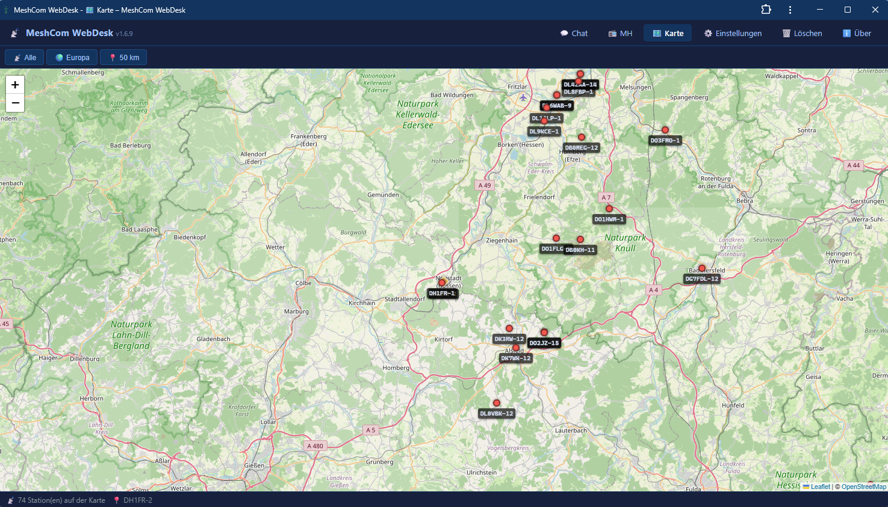

```
  ███╗   ███╗███████╗███████╗██╗  ██╗ ██████╗ ██████╗ ███╗   ███╗
  ████╗ ████║██╔════╝██╔════╝██║  ██║██╔════╝██╔═══██╗████╗ ████║
  ██╔████╔██║█████╗  ███████╗███████║██║     ██║   ██║██╔████╔██║
  ██║╚██╔╝██║██╔══╝  ╚════██║██╔══██║██║     ██║   ██║██║╚██╔╝██║
  ██║ ╚═╝ ██║███████╗███████║██║  ██║╚██████╗╚██████╔╝██║ ╚═╝ ██║
  ╚═╝     ╚═╝╚══════╝╚══════╝╚═╝  ╚═╝ ╚═════╝ ╚═════╝ ╚═╝     ╚═╝
    ██╗    ██╗███████╗██████╗ ██████╗ ███████╗███████╗██╗  ██╗
    ██║    ██║██╔════╝██╔══██╗██╔══██╗██╔════╝██╔════╝██║ ██╔╝
    ██║ █╗ ██║█████╗  ██████╔╝██║  ██║█████╗  ███████╗█████╔╝
    ██║███╗██║██╔══╝  ██╔══██╗██║  ██║██╔══╝  ╚════██║██╔═██╗
    ╚███╔███╔╝███████╗██████╔╝██████╔╝███████╗███████║██║  ██╗
     ╚══╝╚══╝ ╚══════╝╚═════╝ ╚═════╝ ╚══════╝╚══════╝╚═╝  ╚═╝
```

# MeshCom WebDesk

A **Blazor Server** web application for communicating with a [MeshCom 4.0](https://icssw.org/meshcom/) node via UDP (EXTUDP JSON protocol).  
Built with **.NET 10** and **Blazor Interactive Server**.

> **MeshCom Firmware:** Compatible with [icssw-org/MeshCom-Firmware](https://github.com/icssw-org/MeshCom-Firmware) v4.35+

> 💾 **Ready-to-run binaries** (Windows & Linux) – no build required:  
> 👉 [**Download latest release**](https://github.com/DH1FR/MeshcomWebDesk/releases/latest)

> ☕ **Do you like my work? Then buy me a coffee!**  
> [](https://paypal.me/DH1FR)

---

## 💡 Motivation

MeshCom always reminds me a little of the good old **Packet Radio** days – digital text communication over radio, simple and direct.

That is why I created this **MeshCom WebDesk**.

and makes a full web client for MeshCom available via a simple URL

---

## Screenshots





---

## Features

### 💬 Chat
- **Multi-tab conversations** – each partner (callsign, group, broadcast) gets its own tab
- **Broadcast tab "All"** for `*` / `CQCQCQ` messages
- **Direct messages** – each callsign gets its own tab automatically
- **Group messages** – group destinations appear as `#<group>` tabs with optional whitelist filter
- Smart routing: broadcast replies from a known callsign appear in their direct tab
- **Auto-scroll** to the latest message when a tab is opened or a new message arrives
- **Unread badge** – inactive tabs show a yellow counter badge for new messages
- **ACK delivery indicator** on every outgoing message:
  - `⏳` grey – waiting for node echo (message queued)
  - `✓` blue – node has transmitted over LoRa (sequence number assigned)
  - `✓✓` green – recipient confirmed delivery (APRS ACK received)
- **Clickable callsigns in the monitor** – click any sender or recipient to open a chat tab instantly
- **QRZ.com tooltips** – when enabled, hovering over any callsign (tab buttons, chat messages, monitor From/To) shows the operator's first name and home QTH (e.g. `Chat mit DH1FR-2 öffnen · Max, Berlin`)
- **Audio notification** 🔔 when a new direct message to your own callsign arrives (Web Audio API, no audio file required); mute toggle in the status bar

### 📻 MH – Most Recently Heard
- Live table of all heard stations with last message, timestamp and message count
- **GPS position** parsed from EXTUDP position packets (`lat_dir` / `long_dir` APRS format)
- **Distance calculation** (Haversine) from own position to each heard station
- **Battery level** 🔋 column parsed from `batt` field in position/telemetry packets, colour-coded (🟢 >60% / 🟡 >30% / 🔴 ≤30%)
- **Hardware badge** – short hardware name from `hw_id` field (e.g. `T-BEAM`, `T-ECHO`, `HELTEC-V3`)
- **Firmware tooltip** – hover the callsign to see firmware version, hardware ID and first-heard time
- **QRZ.com callsign data** – when the QRZ.com integration is enabled, a dedicated **Name / Location** column shows each operator's first name and home QTH; the same data also appears as a hover tooltip on every callsign
- **RSSI / SNR** signal quality with colour coding (green / yellow / red)
- Altitude correctly converted from APRS feet to metres
- 🗺️ OpenStreetMap link per station
- Own position extracted automatically from the node's `type:"pos"` UDP beacon
- **Browser GPS** button to use device geolocation as own position
- Click 💬 to open a chat tab with any station

### 📡 Monitor (lower pane)
- Structured display with type badge (`MSG` / `POS` / `TEL` / `ACK` / `SYS`), direction (`RX` / `TX`), routing and signal
- **Full relay path** shown inline for relayed messages: `OE1XAR-62 ⟶ DL0VBK-12 ⟶ DB0KH-11 → all`
- **Telemetry rows** (`type:"tele"`) display temperature 🌡️, humidity 💧, pressure 🧭 and battery 🔋
- Colour-coded rows: green for TX, cyan for position beacons, purple for telemetry, gold for ACKs
- **UDP registration packet** (`{"type":"info",...}`) sent on startup is shown as a `SYS` TX entry
- Newest entry always at the top; configurable history limit (`MonitorMaxMessages`)
- **Resizable**: drag the divider bar between chat and monitor to adjust the split – last position is saved in `localStorage` and restored on the next visit
- Collapsible on mobile (toggle button)

### 📊 Status bar
- UDP socket state (🟢 Active / 🔴 Inactive) and registration status
- Last RX timestamp, sender callsign, RSSI / SNR with colour coding
- TX counter, own callsign, device IP:Port
- Own GPS position with source label (Node / Browser GPS)
- 🔔 / 🔕 Sound notification toggle

### 🔄 Deduplication
- Incoming messages are deduplicated using the `msg_id` field (unique hex ID from the node)
- Fallback chain: `msg_id` → `{NNN}` sequence number → message text
- Duplicate suppression window: 10 minutes (rolling cache, auto-pruned)

### 💾 State Persistence
- Chat tabs, MH list, monitor history and **own GPS position** are saved to disk on shutdown
- State is restored automatically on startup – no waiting for the first position beacon
- Auto-save every 5 minutes; data stored in `DataPath` (configurable)

### 🚀 Startup
- **ASCII banner** with version number printed to the console/terminal on every start
- **Browser auto-open**: when launched directly as an executable the default browser opens automatically at `http://localhost:5162`
- Skipped when running in Docker, as a Windows service, or under systemd
- **Portable data paths**: all data (`data/`), logs (`logs/`) and keys (`data/keys/`) are stored next to the executable by default – no hard-coded `C:\Temp` paths

### ℹ️ About page
- Displays assembly version (e.g. `v1.4.1`), build timestamp and links
- Version is also shown in the **navigation bar** next to the app title
- Author contact: [dh1fr@darc.de](mailto:dh1fr@darc.de)

### ⚙️ Settings page
- Web-based configuration editor at `/settings` – edit all settings directly in the browser
- Changes are written to `appsettings.override.json` in `DataPath` (Docker-safe read-only mount supported)
- Most settings apply **immediately without restart**
- Settings that still require a restart: **Listen-IP / Listen-Port** (socket binding) and **Log-Path / Log-Retention** (Serilog)

### 🌐 UI Language
- Full bilingual interface: **Deutsch 🇩🇪** and **English 🇬🇧**
- Language is selected in **Settings → Language** and persisted in `appsettings.override.json`
- Switching applies **instantly** across all pages without any page reload or restart

### 📡 Beacon (Bake)
- **Periodic beacon** – sends a configurable text to a configurable group at a fixed interval
- Interval is configurable in whole hours (minimum 1 h); first transmission after **one full interval** (no send on every restart)
- Enabled / disabled via `BeaconEnabled` flag – applies **live** without restart
- **`{version}` placeholder** in `BeaconText` is replaced with the running application version at send time
- **Status indicator** in the status bar: pulsing `●` dot with next scheduled send time; turns yellow when < 10 min away
- Beacon appears in the monitor feed and in the corresponding group chat tab
- **"Send Beacon Now"** test button in Settings – sends the beacon immediately without waiting for the interval

### ↩️ Auto-Reply
- Sends a configurable reply text automatically when a **brand-new direct chat tab** is opened by an incoming message (first contact from a callsign)
- Enabled / disabled via `AutoReplyEnabled` – applies **live** without restart
- **`{version}` placeholder** in `AutoReplyText` is replaced with the running application version at send time  
  Example: `MeshCom WebDesk V{version}` → `MeshCom WebDesk V1.4.1`
- **Test button** in Settings – send the auto-reply text immediately to any callsign without waiting for an incoming message

### 📊 Telemetry (Telemetrie-Sender)
- **Periodic telemetry messages**
- **Source-agnostic**: any system can write the JSON file – Home Assistant, Node-RED, MQTT bridge, shell script, etc.
- **HTTP POST endpoint** `POST /api/telemetry` – external sources (e.g. Home Assistant) can push JSON directly; no shared filesystem needed; protected by optional `X-Api-Key` header
- **Flexible mapping** – unlimited key → label / unit / decimal-places pairs, fully configurable in the Settings UI without touching source code
- **Auto-split**: if all values exceed 150 chars, messages are automatically split into `TM1:` / `TM2:` / … with a 2-second pause between packets
- **Destination** – group (e.g. `#262`), broadcast (`*`) or direct callsign (e.g. `OE1KBC-1`)
- **Status indicator** in the status bar analogue to the beacon
- **Live preview** in Settings: shows current file values, formatted output per entry, and exact LoRa message(s)
- **Instant send button** in Settings for immediate test send without waiting for the interval
- Example messages: `TM: 🌡=10.7C 🧭=1022hPa 💧=86% 🌬=0.0m/s` or split into `TM1:` / `TM2:` when needed
- 📖 **[Home Assistant integration guide](docs/homeassistant-telemetry.md)** – complete example with weather station sensors, `rest_command` and automation

### 📝 Logging (Serilog)
- Rolling daily log files with configurable retention
- Optional UDP traffic log (`LogUdpTraffic`) for offline analysis

### 🗄️ Database integration (Beta)
- Optional persistent storage of all monitor data to an external database
- **MySQL / MariaDB**: writes each monitor entry as a row via parametrised `INSERT` (uses `MySqlConnector`)
- **InfluxDB 2**: writes each monitor entry as a point via HTTP Line Protocol (`/api/v2/write`)
- Provider selection in **Settings → 🗄️ Datenbank (Beta)**: `none` / `mysql` / `influxdb2`
- **"Test connection"** button: detects missing database, table or bucket and offers **automatic creation** with a single click
- **Optional insert logging** – every successful write is logged at `Information` level; privacy notice shown in Settings
- Provider and connection settings change **live without restart**

### 💬 Message length validation
- MeshCom LoRa packets are limited to **149 characters** of message text
- **Character counter** `X/149` next to the input field: grey → yellow (≥ 130) → red bold (≥ 145)
- `maxlength="149"` prevents over-long input in the browser
- **Server-side guard** in `SendMessageAsync`: logs a warning and aborts send if text exceeds 149 characters

### 🗺️ Live Map
- Interactive map at `/map` powered by **Leaflet.js + OpenStreetMap**
- **APRS-style markers**: filled circle colour-coded by RSSI (🟢 > −90 / 🟡 > −105 / 🔴 ≤ −105 dBm) + callsign label below
- **Own position** shown as gold diamond ◆ (APRS convention)
- **Popup** on click: callsign, **QRZ operator name / QTH** (when enabled), last message, RSSI, battery, altitude
- **First open**: map automatically zooms to a **50 km radius** around own position (once own GPS is known)
- **View persistence**: last map position and zoom level are saved in `localStorage` and restored on every subsequent visit
- **Compact info bar** at the bottom: `📡 N Station(en) · 📍 MyCallsign` – clean one-liner regardless of station count
- Updates in real-time as new position beacons arrive
- Nav link 🗺️ added to the navigation bar

### 🔗 Webhook
- **HTTP POST** to a configurable URL on incoming events
- Configurable **triggers**: chat messages / position beacons / telemetry (each individually)
- **JSON payload**: `event`, `timestamp`, `from`, `to`, `text`, `rssi`, `snr`, `latitude`, `longitude`, `altitude`, `battery`, `firmware`, `relay_path`, `src_type`
- Fire-and-forget (10 s timeout); errors logged and swallowed – never blocks reception
- Configured in **Settings → 🔗 Webhook**; changes apply **live without restart**
- Compatible with **Home Assistant** webhooks, Node-RED, n8n, IFTTT, custom endpoints

### 📱 PWA – Progressive Web App
- **Installable** on any device via the browser's "Add to Home Screen" / "Install" prompt
- `manifest.webmanifest` with name, icon, `display: standalone`, shortcuts (Chat + Map)
- **Minimal service worker** – enables install prompt; full offline not possible (Blazor Server requires live connection)
- **Apple meta tags** for iOS Safari Add-to-Home-Screen
- Custom **antenna SVG icon** in the app colour scheme

### 🔍 QRZ.com Callsign Lookup
- Optional integration with the **[QRZ.com XML API](https://www.qrz.com/page/xml_data.html)** for operator name and home location
- Requires a free [QRZ.com](https://www.qrz.com/register) account (username + password – no separate API key)
- **Login flow**: the app fetches a session key automatically on first lookup and refreshes it transparently on expiry
- **Free account** returns first name + city/QTH – sufficient for all MeshCom WebDesk displays
- **XML subscription** (~$30/year) unlocks full profile data
- **SSID stripping**: `DH1FR-2` is looked up as `DH1FR` automatically
- Results are **cached in memory** per app session – each callsign is only queried once regardless of how many pages display it
- **Shown everywhere a callsign appears:**
  - 📻 **MH list** – dedicated *Name / Location* column + hover tooltip on the callsign cell
  - 💬 **Chat** – hover tooltip on tab buttons (direct chats) and on every callsign in messages and monitor rows
  - 🗺️ **Map** – callsign popup shows name and QTH below the bold callsign
- Configured in **Settings → 🔍 QRZ.com**; can be enabled/disabled **live without restart**
- Test button in Settings: performs a live lookup of your own callsign and shows the result immediately
- Cache-clear button in Settings: forces fresh lookups after account upgrade or data change
- All errors (wrong credentials, network failure, unknown callsign) are logged as **Warning** in the Serilog log file

### 🔒 HTTPS for LAN (required for PWA on mobile)
- **`scripts/create-lan-cert.ps1`** – one-click self-signed certificate generator for Windows PowerShell
  - Auto-detects LAN IP; can also be set manually with `-LanIp`
  - Creates cert with **IP SAN** (Subject Alternative Name) so browsers accept it without warnings
  - Exports `certs/meshcom-lan.pfx` for Kestrel + `certs/meshcom-lan.crt` for mobile device trust
  - Trusts the cert in **Windows `CurrentUser\Root`** automatically
- New launch profile **`lan-https`** – binds HTTP `:5162` and HTTPS `:5163` simultaneously
- `appsettings.LanHttps.json` – Kestrel HTTPS endpoint configuration (loaded via `ASPNETCORE_ENVIRONMENT=LanHttps`)
- HTTP on port 5162 **stays active** – existing bookmarks and Docker deployments are unaffected
- HTTPS is only needed for PWA installation on Android / iPad / iPhone over LAN

---

## Architecture

```
MeshcomWebDesk/              ← Blazor Server (ASP.NET Core host)
│  Program.cs                  ← DI setup, Serilog, hosted services
│  appsettings.json            ← All configuration
│  appsettings.LanHttps.json   ← Kestrel HTTPS endpoint on :5163 (for PWA on mobile)
│
├─ Components/
│  ├─ App.razor                ← HTML shell + JS helpers + Leaflet CDN + SW registration
│  ├─ Layout/
│  │    MainLayout.razor       ← Top navigation bar
│  └─ Pages/
│       Chat.razor             ← Chat tabs + monitor pane + status bar
│       Mh.razor               ← Most Recently Heard table + own position
│       Map.razor              ← Live Leaflet map with APRS-style markers
│       Settings.razor         ← Web-based configuration editor
│       About.razor            ← Version / copyright / build info + PayPal donation link
│       Clear.razor            ← Data reset page
│
├─ Helpers/
│     GeoHelper.cs             ← Haversine, coordinate formatting, OSM links
│     MeshcomLookup.cs         ← hw_id → hardware name table, firmware formatter
│
├─ Models/
│     MeshcomMessage.cs        ← Message model (from/to/text/GPS/RSSI/ACK/relay/telemetry)
│     MeshcomSettings.cs       ← Strongly-typed config (IOptions)
│     TelemetryMappingEntry.cs ← Telemetry mapping entry (JSON key → label + unit + decimals)
│     DatabaseSettings.cs      ← DB provider + connection settings + LogInserts
│     WebhookSettings.cs       ← Webhook URL + trigger flags
│     QrzSettings.cs           ← QRZ.com credentials + enabled flag
│     ChatTab.cs               ← Tab model with UnreadCount
│     HeardStation.cs          ← MH list entry (GPS, signal, battery, hardware, firmware)
│     ConnectionStatus.cs      ← Live UDP status + own GPS position
│     PersistenceSnapshot.cs   ← Serialisable state snapshot (tabs, MH, monitor, own GPS)
│
├─ wwwroot/
│     map.js                   ← Leaflet JS helpers (init, updateMarkers, APRS icons)
│     manifest.webmanifest     ← PWA manifest (name, icon, display:standalone, shortcuts)
│     service-worker.js        ← Minimal SW – enables install prompt
│     icons/icon.svg           ← Antenna icon in app colour scheme
│     certs/                   ← LAN certificate directory (not in repo – .gitignore)
│
├─ scripts/
│     create-lan-cert.ps1      ← PowerShell: generates self-signed cert for HTTPS LAN access (Windows)
│     create-lan-cert.sh       ← Bash: generates self-signed cert for HTTPS LAN access (Linux / Docker)
│     start-https.sh           ← Bash: starts Docker Compose with HTTPS overlay (checks cert first)
│
├─ docker-compose.yml         ← Standard deployment: HTTP only (always works)
├─ docker-compose.https.yml   ← HTTPS overlay: adds port 5163 + cert volume (requires cert)
│
└─ Services/
      MeshcomUdpService.cs     ← BackgroundService: UDP RX/TX, JSON parsing, ACK matching, beacon timer
      ChatService.cs           ← Singleton: routing, tabs, MH list, monitor, deduplication, webhook trigger
      DataPersistenceService.cs← BackgroundService: load/save state to JSON on disk
      SettingsService.cs       ← Writes appsettings.override.json in DataPath (Docker-safe); changes applied live via IOptionsMonitor
      LanguageService.cs       ← Singleton: UI language switching (de/en); T(de,en) helper; OnChange event for instant re-render
      WebhookService.cs        ← HTTP POST fire-and-forget on message / position / telemetry events
      QrzService.cs             ← QRZ.com XML API: session login, callsign lookup, in-memory cache
      Database/
        IMonitorDataSink.cs    ← Interface: WriteAsync(MeshcomMessage)
        MySqlMonitorSink.cs    ← MySQL / MariaDB write sink (MySqlConnector)
        InfluxDbMonitorSink.cs ← InfluxDB 2 write sink (HTTP Line Protocol)
        MonitorSinkService.cs  ← Routes each write to the active provider; IOptionsMonitor-aware
        DatabaseSetupService.cs← Connection test + automatic schema creation (DB, table, bucket)
```

---

## Configuration

All settings in `MeshcomWebDesk/appsettings.json`:

```json
"Meshcom": {
  "ListenIp":           "0.0.0.0",       // bind address (0.0.0.0 = all interfaces)
  "ListenPort":         1799,            // local UDP port
  "DeviceIp":           "192.168.1.60",  // MeshCom node IP
  "DevicePort":         1799,            // MeshCom node UDP port
  "MyCallsign":         "NOCALL-1",       // own callsign
  "LogPath":            "C:\\Temp\\Logs",// log file directory
  "LogRetainDays":      30,              // log file retention in days
  "LogUdpTraffic":      false,           // log every UDP packet to file
  "MonitorMaxMessages": 1000,            // max monitor history (oldest dropped)
  "GroupFilterEnabled": true,            // only show whitelisted group tabs
  "Groups":             ["#20","#262"],  // whitelisted groups (GroupFilterEnabled=true)
  "DataPath":           "C:\\Temp\\MeshcomData", // persistent state directory
  "AutoReplyEnabled":   false,           // send auto-reply on first contact
  "AutoReplyText":      "...",           // auto-reply text; {version} → app version
  "BeaconEnabled":      false,           // send periodic beacon (Bake)
  "BeaconGroup":        "#262",          // target group for beacon
  "BeaconText":         "...",           // beacon text; {version} → app version
  "BeaconIntervalHours": 1,              // beacon interval in hours (minimum 1)
  "TelemetryEnabled":      false,        // send periodic telemetry message
  "TelemetryFilePath":     "/data/telemetry.json", // source JSON file (written by HA, script etc.)
  "TelemetryGroup":        "#262",       // destination: group (#262), broadcast (*), or callsign
  "TelemetryScheduleHours":   "11,15",      // send at 11:00 and 15:00 (comma-separated hours 0–23)
  "TelemetryApiEnabled":   false,        // enable POST /api/telemetry HTTP endpoint
  "TelemetryApiKey":       "",           // optional X-Api-Key for the endpoint (empty = no auth)
  "Language":              "de",         // UI language: "de" (German) or "en" (English)
  "Database": {                          // optional database sink (Beta)
    "Provider":              "none",     // "none" | "mysql" | "influxdb2"
    "MySqlConnectionString": "",         // e.g. "Server=localhost;Database=meshcom;User=mc;Password=secret;"
    "MySqlTableName":        "meshcom_monitor", // created automatically via Settings → Anlegen
    "InfluxUrl":             "http://localhost:8086",
    "InfluxToken":           "",
    "InfluxOrg":             "meshcom",
    "InfluxBucket":          "meshcom",
    "LogInserts":            false       // log every successful write at Information level
  },
  "Webhook": {
    "Enabled":     false,              // send HTTP POST on events
    "Url":         "",                 // target URL (HTTP POST, JSON body)
    "OnMessage":   true,               // fire on incoming chat messages
    "OnPosition":  false,              // fire on incoming position beacons
    "OnTelemetry": false               // fire on incoming telemetry
  },
  "Qrz": {
    "Enabled":  false,                 // enable QRZ.com XML API callsign lookups
    "Username": "",                    // QRZ.com login username (usually your callsign)
    "Password": ""                     // QRZ.com login password
  },
  "TelemetryMapping": [                  // any number of entries; configure in Settings UI
    { "JsonKey": "aussentemp",  "Label": "🌡",  "Unit": "C",   "Decimals": 1 },
    { "JsonKey": "luftdruck",   "Label": "🧭",  "Unit": "hPa", "Decimals": 1 },
    { "JsonKey": "pv_leistung", "Label": "☀",  "Unit": "kW",  "Decimals": 2 }
  ]
}
```

### LAN access (iPad / mobile)

The `lan` launch profile binds to all network interfaces:

```powershell
# In Visual Studio: select profile "lan" next to the Run button
# Then open in browser on any device in the same network:
http://192.168.x.x:5162
```

### UDP traffic logging

Set `"LogUdpTraffic": true` to write every packet to the log file:

```
[INF] [UDP-RX] 192.168.1.60:1799 {"src_type":"lora","type":"msg","src":"DH1FR-1",...}
[INF] [UDP-TX] 192.168.1.60:1799 {"type":"msg","dst":"DH1FR-1","msg":"Hello"}
```

Filter the log file:
```powershell
Select-String "\[UDP-RX\]" C:\Temp\Logs\MeshcomWebDesk-*.log
Select-String "\[UDP-TX\]" C:\Temp\Logs\MeshcomWebDesk-*.log
```

---

## EXTUDP Protocol

This client communicates with the MeshCom node using the **EXTUDP JSON protocol** defined in the [MeshCom firmware](https://github.com/icssw-org/MeshCom-Firmware).

### Packet types

| `type` | Description | Handled as |
|--------|-------------|------------|
| `msg`  | Chat message (direct, broadcast, group, ACK) | Chat tab + monitor |
| `pos`  | Position beacon with GPS coordinates | MH list + monitor |
| `tele` | Telemetry (temperature, humidity, pressure, battery) | MH list + monitor |

### Example packets

| Direction | Example |
|-----------|---------|
| Registration | `{"type":"info","src":"NOCALL-2"}` |
| Chat RX (direct) | `{"src_type":"lora","type":"msg","src":"NOCALL-1","dst":"NOCALL-2","msg":"Hello{034","msg_id":"5DFC7187","rssi":-95,"snr":12,"firmware":35,"fw_sub":"p"}` |
| Chat RX (relayed) | `{"src_type":"lora","type":"msg","src":"OE1XAR-62,DL0VBK-12,DB0KH-11","dst":"*","msg":"...","rssi":-109,"snr":5}` |
| Position RX | `{"src_type":"lora","type":"pos","src":"DB0MGN-1,...","lat":50.57,"lat_dir":"N","long":10.42,"long_dir":"E","alt":1243,"batt":100,"hw_id":42,"firmware":35,"fw_sub":"p","rssi":-108,"snr":5}` |
| Telemetry RX | `{"src_type":"lora","type":"tele","src":"DB0MGN-1,...","batt":100,"temp1":20.6,"hum":0,"qnh":1031.4}` |
| Chat TX | `{"type":"msg","dst":"NOCALL-1","msg":"Hello"}` |
| ACK RX | `{"src_type":"udp","type":"msg","src":"NOCALL-1","dst":"NOCALL-2","msg":"NOCALL-2  :ack034","msg_id":"A177E139"}` |

### ACK delivery tracking

1. Outgoing message sent → `⏳` pending
2. Node echo arrives with sequence marker `{034}` → stored, indicator changes to `✓`
3. Recipient sends APRS ACK `:ack034` → message marked as delivered `✓✓`

### Hardware IDs (`hw_id`)

| ID | Short name | Hardware |
|----|-----------|---------|
| 1–3 | TLORA-V1/V2 | TTGO LoRa32 |
| 4–6, 12 | T-BEAM | TTGO T-Beam |
| 7 | T-ECHO | LilyGO T-Echo |
| 8 | T-DECK | LilyGO T-Deck |
| 9 | RAK4631 | Wisblock RAK4631 |
| 10–11, 43 | HELTEC-V1/V2/V3 | Heltec WiFi LoRa 32 |
| 39 | EBYTE-E22 | Ebyte LoRa E22 |

> **Note:** Altitude in position packets follows APRS convention (feet). The client converts to metres automatically.

---

## Requirements

> 💡 **No build required:** Ready-to-run binaries for Windows and Linux are available under [Releases](https://github.com/DH1FR/MeshcomWebDesk/releases/latest).

- [.NET 10 Runtime](https://dotnet.microsoft.com/en-us/download/dotnet/10.0) *(ASP.NET Core Runtime, required to run the Windows binary)*
- [.NET 10 SDK](https://dotnet.microsoft.com/download/dotnet/10.0) *(only required for build from source)*
- A reachable MeshCom node running firmware [v4.35+](https://github.com/icssw-org/MeshCom-Firmware/releases) with EXTUDP enabled
- UDP port 1799 open (Windows Firewall / router)

### ⚠️ Windows SmartScreen warning

When running the `.exe` for the first time, Windows may show **"Windows protected your PC"**.  
This happens because the binary is not code-signed.

**To run it anyway:**
1. Click **"More info"** in the SmartScreen dialog
2. Click **"Run anyway"**

**Alternative:** Right-click the `.exe` → **Properties** → check **"Unblock"** → OK

---

## Build & Run

```powershell
cd MeshcomWebDesk
dotnet run --launch-profile lan         # HTTP only, accessible from all LAN devices
# or
dotnet run --launch-profile lan-https   # HTTP :5162 + HTTPS :5163 (required for PWA on mobile)
# or
dotnet run                              # localhost only
```

Then open `http://localhost:5162` (or `http://<your-ip>:5162` for LAN access).

### HTTPS for LAN (PWA on mobile)

```powershell
# Step 1 – Generate self-signed certificate (once, run as admin)
cd C:\SRC\RA\MeshcomWebDesk
.\scripts\create-lan-cert.ps1          # auto-detects LAN IP
# or: .\scripts\create-lan-cert.ps1 -LanIp 192.168.1.100

# Step 2 – Start app with HTTPS
cd MeshcomWebDesk
dotnet run --launch-profile lan-https
```

> **Mobile trust:** Copy `certs/meshcom-lan.crt` to your phone and install it as a trusted root CA.
> Then open `https://<your-ip>:5163` in the browser and install the PWA.

---

## 🔒 HTTPS & Zertifikat – Schritt-für-Schritt / Step by Step

### 🇩🇪 Deutsch

Das selbstsignierte Zertifikat ermöglicht verschlüsselten HTTPS-Zugriff im Heimnetz.
**Ohne HTTPS** lässt sich die App **nicht als PWA auf Mobilgeräten installieren**.

#### 1. Zertifikat erstellen (einmalig, Windows)

```powershell
# PowerShell als Administrator öffnen
cd C:\SRC\RA\MeshcomWebDesk

# IP automatisch erkennen:
.\scripts\create-lan-cert.ps1

# oder IP manuell angeben:
.\scripts\create-lan-cert.ps1 -LanIp 192.168.1.100
```

Das Skript erstellt:
- `certs/meshcom-lan.pfx` – für Kestrel (wird von der App verwendet)
- `certs/meshcom-lan.crt` – für Mobilgeräte (dort installieren)
- Trägt das Zertifikat in Windows `CurrentUser\Root` ein → **kein Browser-Warning mehr** auf dem PC

#### 1b. Zertifikat erstellen (Linux / Docker-Server)

Voraussetzung: `openssl` installiert (`sudo apt-get install -y openssl`).

```bash
# Skript ausführbar machen (einmalig)
chmod +x scripts/create-lan-cert.sh

# IP automatisch erkennen:
./scripts/create-lan-cert.sh

# oder IP manuell angeben:
./scripts/create-lan-cert.sh 192.168.1.100
```

Das Skript erstellt:
- `MeshcomWebDesk/certs/meshcom-lan.pfx` – für Kestrel im Container
- `MeshcomWebDesk/certs/meshcom-lan.crt` – für Mobilgeräte

#### 2. App mit HTTPS starten

**Windows (dotnet run):**

```powershell
cd MeshcomWebDesk
dotnet run --launch-profile lan-https
```

**Linux / Docker Compose:**

Zwei separate Compose-Dateien – HTTP läuft immer, HTTPS nur wenn Zertifikat vorhanden:

```bash
# HTTP only (Standard – immer funktionsfähig):
docker compose up -d --build

# HTTP + HTTPS (mit Zertifikat-Prüfung):
./scripts/start-https.sh            # prüft ob certs/meshcom-lan.pfx existiert

# oder manuell:
docker compose -f docker-compose.yml -f docker-compose.https.yml up -d --build
```

> `docker-compose.https.yml` setzt `ASPNETCORE_ENVIRONMENT=LanHttps` und mountet
> `./certs:/app/certs:ro` – wenn das Verzeichnis leer ist, **startet der Container nicht**.
> Das Skript `scripts/start-https.sh` prüft das vorab und gibt eine klare Fehlermeldung.

Beide Ports laufen gleichzeitig:
```
HTTP  → http://192.168.x.x:5162   ← wie bisher, bleibt aktiv
HTTPS → https://192.168.x.x:5163   ← neu, für PWA
```

#### 3. Zertifikat auf Mobilgeräten installieren

Die Datei `certs/meshcom-lan.crt` auf das Gerät übertragen (z. B. per E-Mail oder USB).

| Gerät | Pfad |
|---|---|
| **iPad / iPhone** (iOS) | Einstellungen → Allgemein → VPN & Geräteverwaltung → Profil installieren → danach: Einstellungen → Allgemein → Info → Zertifikatsvertrauenseinstellungen → Zertifikat aktivieren |
| **Android** | Einstellungen → Sicherheit → Verschlüsselung & Anmeldedaten → Zertifikat installieren → CA-Zertifikat |

#### 4. Zertifikat auf Windows-PC installieren

Noetig wenn der Container auf einem Linux-Server laeuft und du von Windows darauf zugreifst.

**Vorbereitung:** `meshcom-lan.crt` vom Linux-Server kopieren (SCP / WinSCP / USB-Stick):

```powershell
scp user@192.168.1.x:/opt/meshcom/certs/meshcom-lan.crt C:\Temp\meshcom-lan.crt
```

**Variante A - Doppelklick (empfohlen):**

1. `meshcom-lan.crt` per Doppelklick oeffnen
2. Klick auf **Zertifikat installieren**
3. Speicherort: **Lokaler Computer** -> Weiter (Adminrechte erforderlich)
4. **Alle Zertifikate in folgendem Speicher speichern** -> Durchsuchen
5. **Vertrauenswuerdige Stammzertifizierungsstellen** -> OK -> Weiter -> **Fertig stellen**
6. Sicherheitswarnung: **Ja**

**Variante B - PowerShell als Administrator:**

```powershell
$cert  = New-Object Security.Cryptography.X509Certificates.X509Certificate2("C:\Temp\meshcom-lan.crt")
$store = New-Object Security.Cryptography.X509Certificates.X509Store("Root","LocalMachine")
$store.Open("ReadWrite"); $store.Add($cert); $store.Close()
Write-Host "Installiert: $($cert.Thumbprint)"
```

Danach **Browser neu starten** (Strg+Shift+Del empfohlen).

> **Firefox** nutzt einen eigenen Zertifikatspeicher.
> Empfehlung: `about:config` -> `security.enterprise_roots.enabled` auf `true` setzen -> neu starten.

Ergebnis: `https://192.168.x.x:5163` zeigt das Schloss-Symbol ohne Warnung.

---

## 📱 PWA – Progressive Web App

### Was ist eine PWA?

Eine **Progressive Web App** ist eine normale Webseite, die sich wie eine native App verhält.
Der Browser bietet an, sie auf dem Gerät zu **installieren** – ohne App Store, ohne Download.

Nach der Installation:
- Eigenes Icon auf dem Home-Screen / Desktop
- Öffnet sich **ohne Adressleiste** (wie eine native App)
- Shortcut-Kacheln für **Chat** und **Karte** im Startmenü (Windows/Android)

> ⚠️ **Offline-Betrieb ist nicht möglich** – MeshCom WebDesk ist Blazor Server und benötigt immer eine Verbindung zum Server.

### PWA installieren

#### 📱 iPhone / iPad (iOS Safari)

1. `https://192.168.x.x:5163` im **Safari** öffnen
2. Zertifikat muss vorab installiert sein (siehe oben)
3. Teilen-Symbol ⤵ antippen → **"Zum Home-Bildschirm"**
4. Namen bestätigen → **Hinzufügen**

#### 🤖 Android (Chrome)

1. `https://192.168.x.x:5163` in **Chrome** öffnen
2. Zertifikat muss vorab installiert sein
3. ⋮ Menü → **"App installieren"** oder automatischer Banner am unteren Rand

#### 💻 Windows / Mac (Chrome oder Edge)

1. `https://192.168.x.x:5163` öffnen (Zertifikat wird automatisch vertraut)
2. In der Adressleiste rechts: **⊕ Installieren**
3. Oder: ⋮ Menü → **"MeshCom WebDesk installieren"**

Die App bekommt ein eigenes Fenster ohne Browser-UI und erscheint im Startmenü / Taskbar.

---

## 🐳 Docker – Deployment on Linux

### Prerequisites

```bash
# Install Docker + Docker Compose plugin (Debian / Ubuntu / Raspberry Pi OS)
sudo apt-get update
sudo apt-get install -y docker.io docker-compose-plugin

# Add current user to the docker group (no sudo needed)
sudo usermod -aG docker $USER
newgrp docker
```

### Initial setup & start

```bash
# Clone repository
git clone https://github.com/DH1FR/MeshcomWebDesk.git
cd MeshcomWebDesk

# Create optional config file (overrides embedded defaults)
cp deploy/appsettings.linux.json appsettings.json
nano appsettings.json          # set DeviceIp, MyCallsign, Groups etc.

# Build image and start container
docker compose up -d --build
```

The container runs in the background and restarts automatically (`restart: unless-stopped`).  
Web interface: **http://\<Linux-IP\>:5162**

> **Note:** `network_mode: host` is required so the container can receive UDP packets from the MeshCom device.

### Changing the configuration

Either edit `appsettings.json` (next to `docker-compose.yml`) or use environment variables in `docker-compose.yml`:

```yaml
environment:
  - Meshcom__DeviceIp=192.168.1.60
  - Meshcom__MyCallsign=NOCALL-1
  - Meshcom__GroupFilterEnabled=true
  - Meshcom__Groups__0=#OE
  - Meshcom__Groups__1=#Test
```

> **Settings saved via the UI** are written to `DataPath/appsettings.override.json` (inside the `./data` volume).  
> The `appsettings.json` mount stays **read-only** (`:ro`) – no container rebuild needed after UI changes.

After any change to `docker-compose.yml` or `appsettings.json`:

```bash
docker compose up -d
```

---

### 🔄 Updating to a new version

Pull the latest changes, rebuild the image and replace the container:

```bash
cd MeshcomWebDesk

# Fetch latest changes
git pull origin master

# Rebuild image and replace container (brief downtime)
docker compose up -d --build

# Remove unused old image (optional)
docker image prune -f
```

### Useful Docker commands

```bash
# Check container status
docker compose ps

# Follow live logs (Ctrl+C to exit)
docker compose logs -f

# Stop container
docker compose stop

# Stop and remove container (config & logs are preserved)
docker compose down

# Stop, remove container and delete image (full reset)
docker compose down --rmi local
```

---

## 💻 Direct installation (without Docker)

Docker is the recommended deployment method. If you prefer not to use Docker, download the binary directly – it is **framework-dependent**, meaning the **.NET 10 Runtime** must be installed on the target machine (no SDK needed).

> 📦 **Download:** [GitHub Releases](https://github.com/DH1FR/MeshcomWebDesk/releases/latest)

---

### Windows

**Prerequisites:**
- [.NET 10 ASP.NET Core Runtime](https://dotnet.microsoft.com/download/dotnet/10.0)

```powershell
# Unzip to e.g. C:\meshcom
Expand-Archive MeshcomWebDesk-vX.Y.Z-win-x64.zip -DestinationPath C:\meshcom

# Edit configuration
notepad C:\meshcom\appsettings.json   # set DeviceIp, MyCallsign

# Start
cd C:\meshcom
.\MeshcomWebDesk.exe
```

Open browser: **http://localhost:5162**

> To run automatically at Windows startup, register as a Windows service:
> ```powershell
> sc.exe create MeshcomWebDesk binPath="C:\meshcom\MeshcomWebDesk.exe" start=auto
> sc.exe start MeshcomWebDesk
> ```

---

### Linux (systemd)
**Prerequisites:**
- [.NET 10 ASP.NET Core Runtime](https://dotnet.microsoft.com/download/dotnet/10.0)

```bash
# Install .NET 10 Runtime (Debian / Ubuntu / Raspberry Pi OS)
sudo apt-get update && sudo apt-get install -y aspnetcore-runtime-10.0

# Extract archive
mkdir meshcom && tar -xzf MeshcomWebDesk-vX.Y.Z-linux-x64.tar.gz -C meshcom
cd meshcom

# Edit configuration (MyCallsign, DeviceIp etc.)
nano appsettings.json

# Install as systemd service (starts automatically at boot)
sudo bash install.sh
```

Web interface: **http://\<Linux-IP\>:5162**

**Useful commands after installation:**
```bash
journalctl -u meshcom-webclient -f     # live log
systemctl status meshcom-webclient     # status
systemctl restart meshcom-webclient    # restart after config change
```

---

### macOS (Intel & Apple Silicon)

**Prerequisites:**
- [.NET 10 ASP.NET Core Runtime](https://dotnet.microsoft.com/download/dotnet/10.0) for macOS

```bash
# Extract the archive (choose the right binary for your CPU)
# Apple Silicon (M1/M2/M3):
tar -xzf MeshcomWebDesk-vX.Y.Z-osx-arm64.tar.gz -C ~/meshcom

# Intel Mac:
tar -xzf MeshcomWebDesk-vX.Y.Z-osx-x64.tar.gz -C ~/meshcom

cd ~/meshcom

# Edit configuration
nano appsettings.json      # set DeviceIp, MyCallsign

# Allow execution (macOS Gatekeeper)
xattr -d com.apple.quarantine MeshcomWebDesk

# Start
./MeshcomWebDesk
```

Open browser: **http://localhost:5162**

> **macOS Gatekeeper:** If you see *"cannot be opened because it is from an unidentified developer"*,  
> run `xattr -d com.apple.quarantine ./MeshcomWebDesk` once before starting.

---

### Linux (systemd)

The shipped `appsettings.json` contains placeholder values – the following **must** be set before first start:

| Key | Description | Example |
|-----|-------------|---------|
| `MyCallsign` | Your own callsign | `NOCALL-1` |
| `DeviceIp` | IP address of the MeshCom node | `192.168.1.60` |
| `LogPath` | Directory for log files | `./logs` / `/var/log/meshcom` |
| `DataPath` | Directory for persistent state | `./data` / `/opt/meshcom/data` |

---

## ⚖️ Legal

### Copyright
© 2025–2026 Ralf Altenbrand (DH1FR) · All rights reserved.

### Usage
This software is made available for **licensed radio amateurs** for **private, non-commercial use**.  
Commercial use is not permitted without explicit written consent from the author.

### Disclaimer
**Use at your own risk.**  
The author accepts no liability for damages of any kind – including but not limited to damage to hardware, network infrastructure, radio equipment or data loss – caused by the use of this software.  
The software is provided without any warranty.

### License
See [LICENSE](LICENSE)

---

## 🔒 Privacy / Datenschutz

> 🇩🇪 **Deutsch** | 🇬🇧 English below

### 🇩🇪 Datenschutzhinweis

MeshCom WebDesk verarbeitet **Funkamateure-Daten** – Rufzeichen und Nachrichtentexte, die über das MeshCom-Netz übertragen werden.  
Diese Daten sind per se öffentlich (LoRa-Funk ist für jeden empfangbar), können aber personenbezogen im Sinne der DSGVO sein.

#### Was gespeichert werden kann

| Funktion | Gespeicherte Daten | Wo |
|---|---|---|
| **Log-Datei** (`LogUdpTraffic: true`) | Rufzeichen, Nachrichtentexte, GPS-Koordinaten, RSSI/SNR – als Rohdaten jedes UDP-Pakets | `LogPath` auf dem Server |
| **Datenbank** (`Database.Provider != "none"`) | Alle Monitor-Einträge: Rufzeichen, Nachrichtentexte, Zeitstempel, GPS, RSSI, Batterie, Firmware | Externer Datenbankserver |
| **DB-Insert-Log** (`LogInserts: true`) | Vollständige SQL-`INSERT`-Anweisungen mit allen Feldinhalten | `LogPath` auf dem Server |
| **Persistenz** (`DataPath`) | Chat-Verlauf, MH-Liste, Monitor-History, eigene GPS-Position | `DataPath` auf dem Server |

#### Empfehlungen

- **UDP-Traffic-Log** (`LogUdpTraffic`) nur aktivieren, wenn zur Fehlersuche nötig; danach wieder deaktivieren.
- **DB-Insert-Log** (`LogInserts`) nur kurzfristig zur Fehlersuche aktivieren; enthält vollständige Nachrichtentexte und Rufzeichen.
- Die **Datenbankanbindung** ist für den Betrieb im **eigenen, abgesicherten Netz** vorgesehen. Externe Datenbankserver sollten verschlüsselte Verbindungen verwenden (`SslMode=Required` im Connection String).
- **Log-Aufbewahrung** (`LogRetainDays`) auf den minimal notwendigen Zeitraum setzen.
- Der Betrieb dieser Software unterliegt den für Funkamateure geltenden **datenschutzrechtlichen Regelungen** (DSGVO, BDSG, ggf. nationale Amateurfunkgesetze). Der Betreiber ist selbst verantwortlich für die rechtskonforme Nutzung.

---

### 🇬🇧 Privacy Notice

MeshCom WebDesk processes **amateur radio data** – callsigns and message texts transmitted over the MeshCom mesh network.  
This data is inherently public (LoRa radio is receivable by anyone), but may constitute personal data under GDPR.

#### What can be stored

| Feature | Data stored | Location |
|---|---|---|
| **Log file** (`LogUdpTraffic: true`) | Callsigns, message texts, GPS coordinates, RSSI/SNR – raw content of every UDP packet | `LogPath` on the server |
| **Database** (`Database.Provider != "none"`) | All monitor entries: callsigns, message texts, timestamps, GPS, RSSI, battery, firmware | External database server |
| **DB insert log** (`LogInserts: true`) | Full SQL `INSERT` statements with all field values | `LogPath` on the server |
| **Persistence** (`DataPath`) | Chat history, MH list, monitor history, own GPS position | `DataPath` on the server |

#### Recommendations

- Enable **UDP traffic logging** (`LogUdpTraffic`) only for troubleshooting; disable it afterwards.
- Enable **DB insert logging** (`LogInserts`) only briefly for debugging; it contains full message texts and callsigns.
- The **database sink** is intended for use within your **own secured network**. External database servers should use encrypted connections (`SslMode=Required` in the connection string).
- Set **log retention** (`LogRetainDays`) to the minimum period necessary.
- Operation of this software is subject to the **data protection regulations** applicable to amateur radio operators (GDPR, national regulations). The operator is solely responsible for lawful use.

---

© by Ralf Altenbrand (DH1FR) 2025–2026

---

## 📋 Changelog

### v1.6.16
- **feat:** 📱 **QRZ-Name im Tab-Button** – der Vorname des Operators erscheint als kleiner Untertitel direkt im Chat-Tab-Button (immer sichtbar, kein Hover nötig)
- **feat:** 🎟️ **Touch-Display-Support** – QRZ-Vorname wird als festes `· Name`-Badge inline bei jedem Rufzeichen angezeigt (Chat-Nachrichten und Monitor-Zeilen), ohne Hover-Interaktion
- **perf:** ⚡ **Nicht-blockierendes QRZ-Laden** – Seiten rendern sofort; QRZ-Daten werden im Hintergrund nach dem ersten Render nachgeladen (`OnAfterRenderAsync` statt `OnInitializedAsync`)
- **perf:** ⚡ **Doppelter Re-Render entfernt** – zweites `StateHasChanged` in `OnChatChanged` nur noch wenn tatsächlich neue QRZ-Daten hinzukamen
- **perf:** ⚡ **Karte synchron** – `UpdateMarkersAsync` verwendet neuen synchronen `QrzService.GetCached()` statt sequentieller `await`-Kette
- **feat:** 💾 **QRZ-Cache persistent** – Lookups werden in `qrz-cache.json` im `DataPath` gespeichert und beim nächsten App-Start automatisch geladen; jedes Rufzeichen wird nur noch einmal abgefragt (auch über Neustarts hinweg)

### v1.6.15
- **feat:** 🔍 **QRZ.com callsign lookup** – optional integration with the QRZ.com XML API; free account returns operator first name + home QTH; session key fetched and refreshed automatically; results cached in memory per session
  - 📻 **MH list** – dedicated *Name / Location* column + hover tooltip on every callsign
  - 💬 **Chat** – QRZ data shown as hover tooltip on tab buttons, chat-message callsigns and monitor From/To callsigns
  - 🗺️ **Map** – callsign popup shows operator name and QTH below the bold callsign
  - Configured in **Settings → 🔍 QRZ.com**; test button + cache-clear button included; on/off live without restart
- **fix:** 🐳 **Docker – HTTPS outbound connections** – added `ca-certificates` to `debian:bookworm-slim` runtime image; fixes *"The SSL connection could not be established"* for all outgoing HTTPS calls (QRZ.com, Webhook, InfluxDB Cloud etc.)

### v1.6.13
- **feat:** 📡 **Resizable monitor pane** – drag handle between chat and monitor lets the user resize the split freely (mouse + touch); last position persisted in `localStorage`
- **fix:** DH1FR greeting is now only sent when the tab is opened by an **incoming** message (not when opened manually with `+`)
- **fix:** 🔒 HTTP→HTTPS redirect disabled in non-`LanHttps` environments – `POST /api/telemetry` no longer redirects Home Assistant to HTTPS
- **feat:** 🚀 Browser auto-opens at `http://localhost:5162` when launched directly as an executable (skipped in Docker / Windows service / systemd)
- **feat:** 🎨 ASCII startup banner now shows **MESHCOM** + **WebDesk** both in block-letter style
- **feat:** 📁 Portable default paths – `data/`, `logs/` and `data/keys/` stored next to the executable; no hard-coded `C:\Temp` paths
- **docs:** `Screenshot_shell.png` added; 🚀 Startup section added to README

### v1.6.9
- **fix:** 📱 **iOS PWA – Leeraum unten** (nur in PWA standalone, nicht im Browser) – Ursache war `height: -webkit-fill-available` in `app.css`, das im PWA-Modus eine kleinere Höhe als `100dvh` liefert; ersetzt durch `position: fixed; inset: 0` (von Apple empfohlene Methode für PWA Full-Screen-Layouts)
- **fix:** 📱 Doppelte `.app-layout`-Definition aus `app.css` entfernt – nur noch in `MainLayout.razor.css` definiert

### v1.6.8
- **fix:** 📱 **iOS PWA – Leeraum unten** (iPhone + iPad) – `padding-bottom: env(safe-area-inset-bottom)` auf `.app-layout` mit `box-sizing: border-box` verschoben; wirkt jetzt zuverlässig auf allen iOS-Geräten
- **fix:** 📱 **iOS PWA – Titel zu groß** – Breakpoint von `390px` auf `480px` erhöht (trifft jetzt alle iPhones inkl. 14 Pro / 15 Plus); Schriftgröße auf `11px` reduziert

### v1.6.7
- **fix:** 📱 **iOS PWA – Safe Area Insets** – App startete zu weit oben (Inhalt unter Statusleiste) und ließ unten Platz frei; `env(safe-area-inset-top/bottom)` korrekt in Header-Höhe und Body eingebunden
- **fix:** 📱 **iOS PWA – Titel zu groß** – Auf kleinen iPhones (SE, mini) war „MeshCom WebDesk" zu groß; neue Media Query für `≤390px` reduziert Schriftgröße und blendet Versionsnummer aus

### v1.6.6
- **feat:** 🐳 **`docker-compose.https.yml`** – HTTPS overlay für Docker Compose; HTTP bleibt in `docker-compose.yml` unverändert; beide Dateien werden mit `-f` kombiniert
- **feat:** **`scripts/start-https.sh`** – Wrapper-Skript prüft ob `certs/meshcom-lan.pfx` existiert und gibt klare Fehlermeldung wenn nicht; startet dann `docker compose -f ... -f ...`
- **fix:** `docker-compose.yml` Encoding-Probleme in Kommentaren behoben

### v1.6.5
- **feat:** 🔒 **`scripts/create-lan-cert.sh`** – Linux/Docker equivalent of the Windows PowerShell cert script; uses `openssl`, auto-detects LAN IP, exports PFX + CRT
- **docs:** 🔒 **HTTPS Docker** – vollständige Anleitung für Zertifikatserstellung auf Linux und Einbindung via Docker Compose volume mount
- **docs:** Architecture updated with `create-lan-cert.sh`

### v1.6.4
- **fix:** 🗺️ **Map – 50km Button** – "An unhandled error has occurred" behoben; `L.circle.getBounds()` ersetzt durch manuelle Haversine-Bounding-Box (funktioniert ohne map context)
- **docs:** 🔒 **HTTPS & Zertifikat** – vollständige Schritt-für-Schritt-Anleitung (Windows, iOS, Android) in der README
- **docs:** 📱 **PWA** – erklärt was PWA ist, wie man es auf iPhone/iPad/Android/Windows installiert

### v1.6.3
- **feat:** 🔒 **HTTPS for LAN** – `scripts/create-lan-cert.ps1` generates a self-signed cert with IP SAN; new `lan-https` launch profile binds HTTP :5162 + HTTPS :5163 simultaneously; required for PWA installation on Android / iPad / iPhone
- **feat:** `appsettings.LanHttps.json` – dedicated Kestrel HTTPS endpoint config; HTTP stays unaffected

### v1.6.2
- **feat:** 🗺️ **Map – Zoom-Buttons** – neue Button-Leiste über der Karte: `📡 Alle` (alle Stationen), `🌍 Europa`, `📍 50 km` (Radius um eigene Position)
- **fix:** 🗺️ **Map – Auto-Zoom** entfernt – Karte zoomt nur noch einmalig beim ersten Laden mit Daten; danach bleibt der Ausschnitt beim Eingang neuer Positionen stabil
- **fix:** 🗺️ **Map – Rufzeichen-Kontrast** verbessert – dunkles halbtransparentes Pill-Label statt Text-Shadow, jetzt auf hellen und dunklen Kartenbereichen lesbar

### v1.6.1
- **fix:** 🗺️ **Map – "Noch keine GPS-Position"** wurde angezeigt obwohl bereits Stationen auf der Karte eingetragen waren – `StateHasChanged()` wird jetzt nach `UpdateMarkersAsync()` aufgerufen
- **fix:** 🗺️ **Map – Station-Strip** ersetzt durch kompakte einzeilige Info-Leiste (`📡 N Station(en) · 📍 Rufzeichen`) – bei vielen Stationen keine unleserliche Liste mehr

### v1.6.0
- **feat:** 🗺️ **Live Map** – interactive Leaflet.js + OpenStreetMap map at `/map`; APRS-style circle markers colour-coded by RSSI; own position as gold diamond; auto-fit bounds; real-time updates
- **feat:** 🔗 **Webhook** – HTTP POST fire-and-forget on incoming messages, position beacons and/or telemetry; configurable URL and triggers in Settings → 🔗 Webhook
- **feat:** 📱 **PWA** – installable as Progressive Web App ("Add to Home Screen"); `manifest.webmanifest`, minimal service worker, Apple meta tags, custom antenna SVG icon
- **feat:** ☕ **Donation link** – PayPal link on the About page (`paypal.me/DH1FR`)
- **docs:** Architecture, Configuration and Changelog updated

### v1.5.0
- **feat:** 🗄️ **Database integration (Beta)** – optional MySQL/MariaDB or InfluxDB 2 sink writes every monitor entry to an external database
- **feat:** **Settings → Datenbank (Beta)** – provider dropdown, connection fields, "Test connection" button with automatic DB/table/bucket creation
- **feat:** **Optional insert logging** (`LogInserts`) – logs the full SQL `INSERT` at Information level; privacy notice shown in Settings UI
- **feat:** **Message length guard** – character counter `X/149` in the chat input, `maxlength="149"` enforced in the browser and server-side warning log when limit is exceeded
- **docs:** 🔒 **Privacy / Datenschutz** section added to README – covers log files, database storage, DB insert log and persistence; includes recommendations for GDPR-compliant operation

### v1.4.3
- **feat:** `TimeOffsetHours` setting – configurable UTC offset for timestamp display (supports half-hour offsets, e.g. `5.5` for IST)
- **fix:** Docker container now runs with `TZ=Europe/Berlin` by default (`tzdata` installed) – `DateTime.Now` correctly reflects MEZ/MESZ including automatic DST switching; `TimeOffsetHours = 0` stays correct in Docker

### v1.4.2
- **feat:** `{version}` placeholder supported in `AutoReplyText` and `BeaconText` – replaced with the running application version at send time
- **feat:** **Test button** for Auto-Reply in Settings – send to any callsign immediately without waiting for an incoming message
- **feat:** Application version shown in the **navigation bar** next to the app title
- **feat:** UDP registration packet (`{"type":"info",...}`) sent on startup now appears in the monitor feed as a `SYS TX` entry
- **feat:** Automatic greeting sent to `DH1FR-2` whenever a new chat tab for that callsign is opened (incoming or manual)

### v1.4.1
- **feat:** `{version}` placeholder supported in `AutoReplyText` and `BeaconText` – replaced with the running application version at send time
- **feat:** **Test button** for Auto-Reply in Settings – send to any callsign immediately without waiting for an incoming message
- **feat:** Application version shown in the **navigation bar** next to the app title
- **feat:** UDP registration packet (`{"type":"info",...}`) sent on startup now appears in the monitor feed as a `SYS TX` entry
- **feat:** Automatic greeting sent to `DH1FR-2` whenever a new chat tab for that callsign is opened (incoming or manual)

### v1.4.0
- **fix:** UDP registration packet no longer sends `dst` or `msg` fields – prevents broadcasting "info" text over the mesh and gateway on startup
- **feat:** Author e-mail address `dh1fr@darc.de` added to About page

### v1.3.0
- Telemetry sender with HTTP POST endpoint (`POST /api/telemetry`)
- Live telemetry preview and instant-send button in Settings
- Home Assistant integration guide
- Auto-split of long telemetry messages (`TM1:` / `TM2:`)
- Configurable telemetry schedule hours

### v1.2.0
- Periodic beacon (Bake) with status indicator
- State persistence (chat tabs, MH list, monitor, own GPS)
- Browser GPS button for own position
- Audio notification for incoming direct messages
- Full relay path display in monitor

### v1.1.0
- ACK delivery tracking (`⏳` / `✓` / `✓✓`)
- MH list with GPS distance, battery level and hardware badge
- Web-based Settings editor
- Multi-language UI (de / en / it / es)

### v1.0.0
- Initial release
